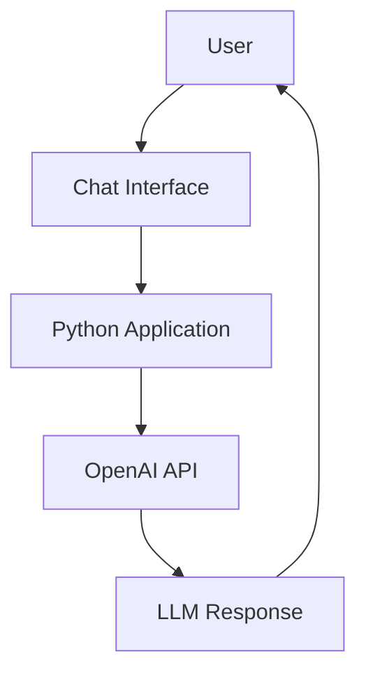

# Simple AI Chatbot

A simple AI chatbot built using the OpenAI API.

The project demonstrates the fundamentals of interacting with Large Language Models (LLMs), sending user prompts, receiving model responses, and building a conversational AI experience.

## Technologies

* Python
* OpenAI API
* Environment variables
* REST/API concepts

## Key Concepts

* LLM API integration
* Prompt handling
* API authentication
* User → LLM → Response workflow

## Architecture

